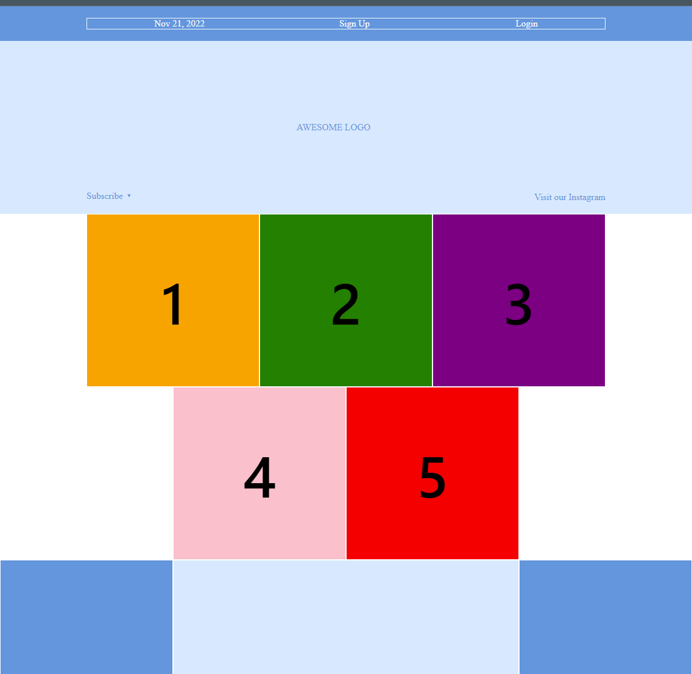

# Flexbox

At this point, we've looked at CSS fundamentals, how to style text, and how to style and manipulate the boxes that your content sits inside. Now it's time to look at how to correctly arrange your boxes in relation to the viewport as well as to one another. By doing that, we are creating the **layout** of our website.  

For a long time, the only reliable cross-browser compatible tools available for creating CSS layouts were features like floats and positioning. These work, but in some ways they're also limiting and frustrating.

Flexbox (short for Flexible Box Layout) is one of the most important layout technologies in modern CSS. It is designed to make it easy for us to lay things out in one dimension — either as a row or as a column.

Flexbox uses two types of boxes: **flex containers** and **flex items**. The job of a flex container is to group a bunch of flex items together and define how they’re positioned. Every HTML element that’s a direct child of a flex container is a flex item. 

Our goal is to create a layout as shown in the following image:


## Flex containers

The first step in using flexbox is to turn one of our HTML elements into a flex container. We do this by setting the `display` property to the value `flex`.

Let's make the `menu-container` div a flex container:

``` css 
.menu-container {
  /* ... */
  display: flex;
}
```

This enables the flexbox layout mode—without it, the browser would ignore all the flexbox properties that we’re about to introduce.

## Aligning a flex item

The next task is to define the horizontal alignment the menu items. That’s what the `justify-content` property is for. We can use it to center our .menu, like so:

``` css
.menu-container {
  /* ... */
  display: flex;
  justify-content: center;    /* Add this */
}
```

Notice how we did this by adding a property to the parent element (the flex container) instead of directly to the element we wanted to center (the flex item). Manipulating items through their containers like this is a common theme in flexbox.

What are other values we can set to this property?

### Distributing multiple flex items

`justify-content` values `space-around` and `space-between` are very useful when having multiple flex items inside a flex container.

``` css
.menu {
  display: flex;
  justify-content: space-around;
}
```

## Grouping flex items

Flex containers only know how to position elements that are one level deep (i.e., their child elements). They don’t care one bit about what’s inside their flex items. 

For example, let’s say you want both the Sign Up and Login links to be on the right side of the page. How to do that?

## Cross-axis (vertical) alignment

Flex containers can also define the vertical alignment of their items

Vertical alignment is defined by adding an `align-items` property to a flex container.

What are all the options for that property?

## Wrapping flex items

Let's first define the photo grid as an flex container.

What happened to the images?

 Adding the following flex-wrap property forces items that don’t fit to get bumped down to the next row:

 ``` css
.photo-grid {
  /* ... */
  flex-wrap: wrap;
}
 ```

## Flex container direction

“Direction” refers to whether a container renders its items horizontally or vertically. So far, all the containers we’ve seen use the default horizontal direction, which means items are drawn one after another in the same row before popping down to the next column when they run out of space.

One of the most amazing things about flexbox is its ability to transform rows into columns using only a single line of CSS.

 ``` css
.photo-grid {
  /* ... */
  flex-direction: column;
}
 ```

A key goal of responsive design is presenting the same HTML markup to both mobile and desktop users. This presents a bit of a problem, as most mobile layouts are a single column, while most desktop layouts stack elements horizontally.

### Alignment considerations

Notice that the column is hugging the left side of its flex container despite our justify-content: center; declaration. When you rotate the direction of a container, you also rotate the direction of the justify-content property. It now refers to the container’s vertical alignment—not its horizontal alignment.

To horizontally center our column, we need to define an align-items property on our `.photo-grid`:

 ``` css
.photo-grid {
  /* ... */
  flex-direction: column;
  align-items: center;      /* Add this */
}
 ```

## Flex container order

With flexbox we can even change the order of HTML elements! 

Let's use `flex-direction: row-reverse;` in our `.photo-grid`.

## Flex item alignment

This entire lesson has been about positioning flex items through their parent containers, but it’s also possible to manipulate individual items. 

What if we want that Subscribe link and those social icons to go at the bottom of the header instead of the center?

``` css
.social,
.subscribe {
  align-self: flex-end;
  margin-bottom: 20px;
}
```

## Flexible items

Flex items are flexible: they can shrink and stretch to match the width of their containers.

The `flex` property defines the width of individual items in a flex container. Or, more accurately, it allows them to have flexible widths. It works as a weight that tells the flex container how to distribute extra space to each item. For example, an item with a `flex` value of 2 will grow twice as fast as items with the default value of 1.

``` css
.footer-three {
  flex: 2;
}
```

### Static item widths

We can even mix-and-match flexible boxes with fixed-width ones. `flex: initial` falls back to the item’s explicit width property. This lets us combine static and flexible boxes in complex ways.

``` css
.footer-one,
.footer-three {
  background-color: #5995DA;
  flex: initial;
  width: 300px;
}
```

Without that `flex: initial;` line, the flex: 1; declaration would be inherited from the `.footer-item` rule, causing the width properties to be ignored. initial fixes this, and we get a flexible layout that also contains fixed-width items. When you resize the browser window, you’ll see that only the middle box in the footer gets resized.

## Materials

- [Flexbox tutorial 1](https://www.internetingishard.com/html-and-css/flexbox/)
- [Flexbox tutorial 2](https://css-tricks.com/snippets/css/a-guide-to-flexbox/)
- [Learn flexbox by playing a game](https://flexboxfroggy.com/)
- [Another game](http://www.flexboxdefense.com/)